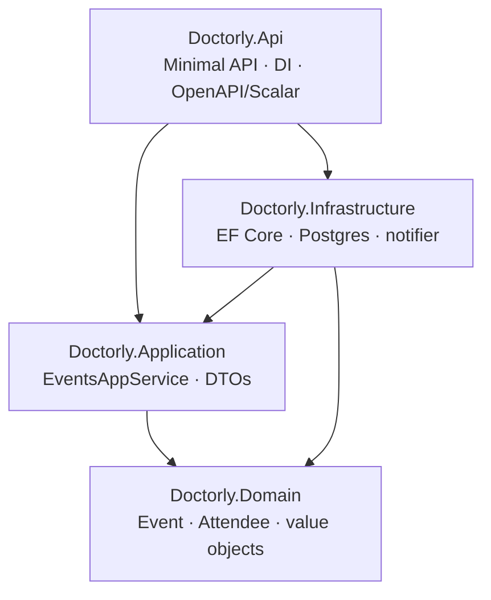
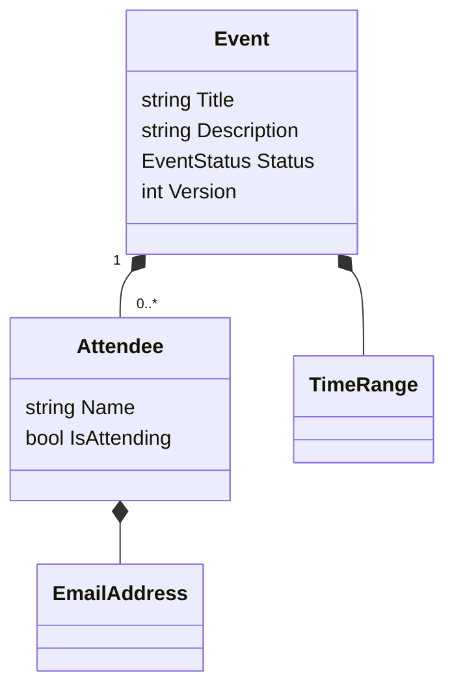
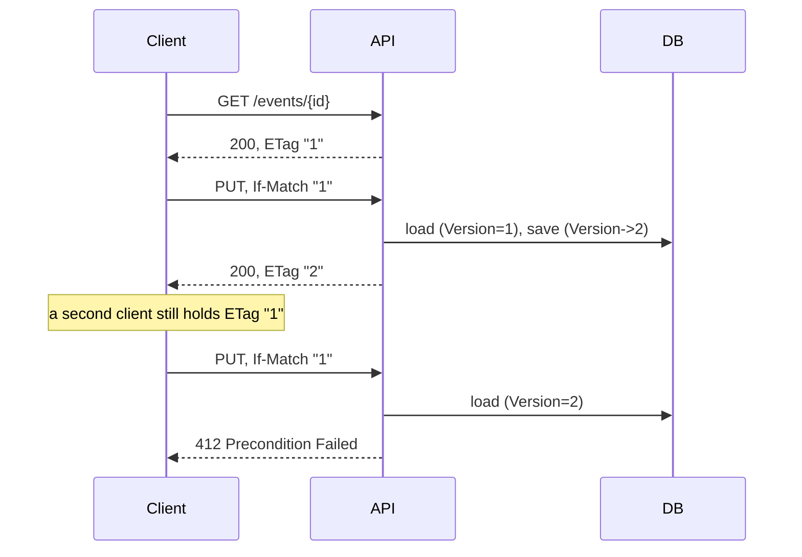

# Doctorly - Practice Calendar API

Backend API for a doctor's practice calendar: events, attendees, RSVPs. No frontend, per
the brief.

## Quick start

```bash
docker compose up -d db
dotnet run --project src/Doctorly.Api
```

Migrations run automatically on startup.

- API: `http://localhost:5080`
- Docs: `http://localhost:5080/scalar`
- OpenAPI: `http://localhost:5080/openapi/v1.json`

```bash
dotnet test tests/Doctorly.Domain.Tests          # no infra
dotnet test tests/Doctorly.Application.Tests     # no infra, Moq
docker compose up -d db
dotnet test tests/Doctorly.Api.Tests             # needs the database
```

## Architecture



`Doctorly.Client` (generated C# HTTP client) sits outside this layering, see API client
below.



`Event` is the aggregate root, `Attendee` only exists inside it. Field limits and
invariants (title length, end > start, etc.) live once in the domain, not duplicated at
the API. `DomainException` maps to `400` at the edge.

## API reference

| Method | Route | Purpose |
|---|---|---|
| POST | `/api/v1/events` | Create event (+ attendees) |
| GET | `/api/v1/events` | List / filter / search |
| GET | `/api/v1/events/{id}` | Get one (`ETag`) |
| PUT | `/api/v1/events/{id}` | Update (needs `If-Match`) |
| DELETE | `/api/v1/events/{id}` | Cancel |
| POST | `/api/v1/events/{eventId}/attendees` | Add attendee |
| PATCH | `/api/v1/events/{eventId}/attendees/{attendeeId}` | Accept/reject (RSVP) |

### Walkthrough

```bash
# create
curl -X POST http://localhost:5080/api/v1/events -H "Content-Type: application/json" -d '{
  "title": "Checkup", "description": "Routine checkup",
  "start": "2026-08-22T08:00:00+02:00", "end": "2026-08-22T08:30:00+02:00",
  "attendees": [{"name": "Jane Doe", "email": "jane@example.com"}]
}'
# -> 201, ETag: "1"

# filter / search
curl "http://localhost:5080/api/v1/events?search=Checkup&attendeeEmail=jane@example.com"

# update needs the current ETag as If-Match
ID=<event id>
curl -i -X PUT http://localhost:5080/api/v1/events/$ID -H "Content-Type: application/json" \
  -H 'If-Match: "1"' -d '{"title":"Checkup (updated)","description":"desc","start":"2026-08-22T09:00:00+02:00","end":"2026-08-22T09:45:00+02:00"}'
# stale If-Match -> 412 instead

# RSVP + add attendee
curl -X PATCH http://localhost:5080/api/v1/events/$ID/attendees/<attendee id> -H "Content-Type: application/json" -d '{"isAttending": true}'
curl -X POST http://localhost:5080/api/v1/events/$ID/attendees -H "Content-Type: application/json" -d '{"name":"Extra Person","email":"extra@example.com"}'

# cancel (soft delete)
curl -X DELETE http://localhost:5080/api/v1/events/$ID   # -> 204
curl http://localhost:5080/api/v1/events/$ID              # still 200, status "Cancelled"
```

## Design decisions

The brief's "Could" question has two parts: same-event concurrent updates, and
preserving data. Different problems, different answers.



`Event.Version` is a domain-owned `int` (not Postgres's `xmin`, so it round-trips through
DTOs without a database concept crossing the layer boundary), exposed as `ETag`/`If-Match`.
A race that slips past the `412` check still hits EF's own concurrency check on save and
returns `409` as the backstop.

- **Preserving data**: every commit writes an append-only `EventRevision` snapshot. Not
  event sourcing, just a queryable history of every version an event has been in.
- **DELETE cancels, doesn't remove**: status flips to `Cancelled`, row and history stay.
- **PUT excludes attendees**: replacing the whole list on every edit would wipe RSVP
  state. Attendees go through their own nested resource instead.
- **List and search share one endpoint**: both just narrow the same result set.
- **Notifications are domain-event driven**: `Event` raises events, a dispatcher forwards
  them to `INotificationService`. Only implementation is a console logger, swapping in
  real email/iCal/MQ is one new class, nothing else changes.
- **Editing a cancelled event returns `400`**, in the same family as the other domain
  guard clauses (title too long, bad time range), not treated as a concurrency conflict.

## Assumptions

- **.NET 9**, not .NET 5 (brief) or .NET 10 - only SDK installed on the build machine.
- **Postgres on host port 55432** - 5432 was already taken locally.
- **All timestamps normalize to UTC** on the way in (`timestamptz` needs a zero offset).
- **Attendee identity is per-event**, not globally unique across events.
- **No auth** - out of scope for the time box, noted as a gap, not solved.

## Must / Should / Could coverage

| Requirement | Status |
|---|---|
| Attendees: Name, Email, Attending | Done |
| Events: Title, Description, Attendees, Start/End | Done |
| Sensible field size limits | Done - in the domain |
| Notifications capability | Done - console/log, real delivery is a swap-in |
| Appropriate testing | Done - 25 domain + 7 application + 8 Postgres-backed tests |
| OpenAPI specification | Done - `/openapi/v1.json` |
| Auto-generated client | Done - `src/Doctorly.Client` |
| Public-facing auto-generated documentation | Done - Scalar at `/scalar` |
| Create / Update / Delete / List (filters) / Search | Done |
| Accept/Reject event | Done - `PATCH` on the attendee resource |
| Same-event update handling | Done - see Design decisions |
| Attendee availability checking | Not built - `TimeRange.Overlaps()` exists, no endpoint uses it |

## API client

`src/Doctorly.Client` is a generated C# client (NSwag), built from a checked-in
`openapi.json` snapshot:

```bash
dotnet tool install -g NSwag.ConsoleCore
nswag run nswag.json
```

Any OpenAPI generator (`openapi-generator`, `kiota`, ...) works the same way for non-.NET
consumers.

## Next steps

1. Real notification delivery behind the existing `INotificationService` seam.
2. Attendee availability checking as an endpoint, using `TimeRange.Overlaps()`.
3. Auth - who can create/update/cancel an event.
4. Ephemeral Testcontainers instead of the shared dev Postgres for integration tests.
